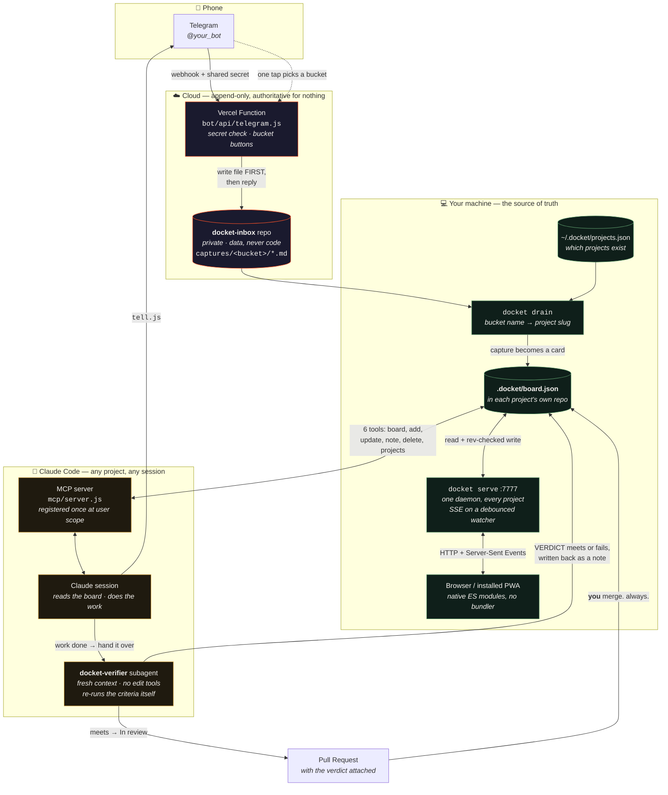

# Docket

**A planning system for one person and one AI working from the same board.**

Type a thought on your phone. It lands in a private repo as a file. A command turns it into a card
on the kanban board that lives *inside* the project it's about — as a JSON file in that project's
own git repo. Claude reads and writes that same board through six MCP tools, so you're both
annotating one document instead of trading status reports. Drag a card into the **Loop** column
and Claude works it unattended, then a *separate* agent with no stake in the work re-runs the
acceptance criteria and rules meets or fails before you ever see a PR.

Zero runtime dependencies. No build step. No database. The only always-on piece is one local Node
process and one free Vercel function.

**Start here:** [`INSTALL.md`](INSTALL.md). The board needs no accounts and no network — clone,
`npm test`, `docket init`, `docket serve`. The phone half is separate and optional.

---

## What it looks like

## The pieces

| Piece | What it is | Cost |
|---|---|---|
| **`bot/`** | A Telegram bot on one Vercel function. A message becomes a committed file; inline buttons file it to a bucket with one tap. 55 tests, no dependencies | Free tier |
| **`docket-inbox`** | A private GitHub repo holding *only* captures. Never code — if it held its own source, every capture would trigger a redeploy | Free |
| **`board/`** | The kanban. Store, daemon, SSE, PWA, CLI, and the drain. State is `.docket/board.json` in the project it describes. 444 tests, no dependencies — plus `docket snapshot`, the board as one script-free HTML file, and `web/`, the same render as a deployed page — which publishes every note on the board, so it refuses to run until told which board | Free |
| **`mcp/`** | Six tools over the same store, registered once at user scope so *every* project — present and future — gets them. The only package with a dependency | Free |
| **`.claude/agents/docket-verifier.md`** | The gate. A subagent with fresh context and **no edit tools** that re-runs your acceptance criteria and writes a verdict | Tokens |

## The loop, in order

1. **Capture.** Phone → Telegram → Vercel → a file in `docket-inbox`. One tap files it to a bucket.
2. **Drain.** `docket drain` matches each bucket name to a project slug and writes cards. Pure
   mechanism — no model, no judgment.
3. **Plan.** You drag cards around at `localhost:7777`. Claude sees the same board through MCP.
4. **Authorize.** Dragging a card into **Loop** is the authorization. Nothing else grants it.
5. **Contract.** A card landing in Loop gets a skeleton. Two headings are *required* —
   `Acceptance` and `Verify with`. Without the first there's no way to know when to stop; without
   the second, "done" is a guess.
6. **Work.** Claude works the column top-down, on a branch, one card at a time.
7. **Gate.** A separate agent re-runs the `Verify with` command itself, checks each clause
   independently, and writes `VERDICT: meets | fails` back to the card as a note.
8. **Review.** meets → *In review* and a PR with the verdict attached. **You merge. Always.**

## Five things that are load-bearing

Copy these or don't bother copying the rest.

1. **The producer never grades the work.** An agent that both builds and judges will report its own
   work as done, confidently, and be wrong. This happened twice in one day here — Claude reported UI
   work as working when a browser probe showed otherwise. On the gate's *first real run* it failed
   two of five cards, both correctly, and one of them for a reason the producer could not have seen:
   it ran `system_profiler`, found the actual display was 3840px wide, and measured a 1960px gap the
   producer had reasoned away. **Spend on the judge, not the worker.** A weak judge is worse than
   none, because it rubber-stamps costume work.
2. **Acceptance criteria and an exact verify command, or it isn't a task.** Then apply the stub test
   to every clause: *could a stub pass this?* "Build a calculator, verified by 7×8×9" gets you a bare
   multiplier. Every verifier here reported the same weakness — the verify commands were consistently
   thinner than the prose above them.
3. **One document, not two.** The board is shared state, not a report. The moment the AI keeps its own
   copy of the plan, they drift and you're reconciling instead of working.
4. **The cloud half is authoritative for nothing.** Captures are a mailbox. Boards live in git, in the
   project they describe. If the cloud vanished you'd lose unfiled notes, never a board. That
   asymmetry is what makes it safe to put a piece of this on the internet.
5. **Ambiguity escalates, never guesses.** A card needing a judgment call moves to *Waiting on you*
   with the question stated plainly. A wrong guess at 2am costs more than a morning's wait.

## If you want to copy it

The architecture is simple on purpose and most of it is transferable; some of it is specific to one
person's machine.

**Transferable.** The contract shape (`board/ui/brief.js`), the verifier's prompt
(`.claude/agents/docket-verifier.md`), the loop protocol in `CLAUDE.md`, and the idea of board
state as a repo-local JSON file that both parties write.

**Yours to decide.** The bot's routing assumes one chat id and one owner, by design — it is a
personal mailbox, not a multi-user service. The board's visual language is one person's taste and
lives in one stylesheet. The `bucket name == project slug` convention is convenient and arbitrary,
and it is the single sharpest edge in setup: see the end of [`INSTALL.md`](INSTALL.md).

**Traps worth knowing before you hit them:**

- Write the capture file **before** sending the reply, or a note is lost waiting for a bucket tap.
- Answer the Telegram callback **before** doing any work — its window is 10 seconds.
- `callback_data` has a hard 64-byte cap. Carry an id and an index, never a path.
- Moves are **create-then-delete**, in that order, so a crash duplicates rather than loses.
- Return 200 on every handled case *including refusals*, or Telegram retries forever.
- Never remove the chat-id whitelist. A bot's username is public and guessable.
- Never let the browser be authoritative. Its predecessor let `localStorage` win and stale copies
  kept healing junk back into the shared file.
- Offline is **read-only**. That rule is what stopped the heal-back loop.

## Reading order

| Document | Read it when |
|---|---|
| [`INSTALL.md`](INSTALL.md) | **Setting it up.** The board works alone; the phone half is optional |
| [`docs/ADOPTING.md`](docs/ADOPTING.md) | **Working in a project that uses it.** The protocol, written to be copied in |
| [`CLAUDE.md`](CLAUDE.md) | Working on Docket itself. Architecture, invariants, and the don'ts |
| [`docs/decision-log.md`](docs/decision-log.md) | "Why was X decided this way?" Append-only |
| [`docs/reviews/2026-08-21-night-shift-review.md`](docs/reviews/2026-08-21-night-shift-review.md) | What was taken from Phil McDonald's *The Night Shift*, what was adapted, and what was refused |

## Credit

The loop protocol — contracts over wishes, and a separate agent grading the work — is adapted
from Phil McDonald's *The Night Shift* (AI Builder Day 2026). What was taken, changed, and
deliberately refused is recorded in the review linked above.
